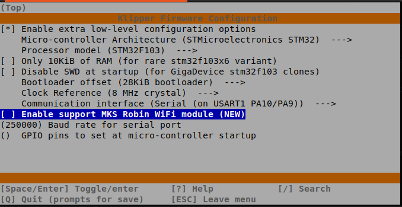

# wireless-klipper
Firmware for MKS Robin WiFi (esp8266) - organizing a `klipper <-> wifi <-> mcu` bridge.

## Source
The firmware source code for esp8266 ([Arduino IDE](https://www.arduino.cc/en/software)) is located in the [wireless_klipper_sta](wireless_klipper_sta) directory.
To build the firmware in the [Arduino IDE](https://www.arduino.cc/en/software), you need to install the libraries for [esp8266](https://github.com/esp8266/Arduino).

In order for the MCU firmware (MKS Robin Nano 1.2) to enable the WiFi module, it is necessary to apply the changes to the MCU Klipper source code - [klipper-wifi-enable_0.1.0.patch](data/klipper-wifi-enable_0.1.0.patch).

## How flash MKS Robin Wi-Fi
The MKS Robin Wi-Fi is essentially an ESP8266 performed by ESP12F. There are quite a lot of options and examples of firmware for ESP12F on the Internet. It is flashed via USB ->RX/TX converter with 3.3V output power.

As one of the examples of ESP12F firmware, I can give the following links:
[https://forum.micropython.org/viewtopic.php?t=7057](https://forum.micropython.org/viewtopic.php?t=7057)
[https://www.youtube.com/watch?v=R-FDJsuH_eE](https://www.youtube.com/watch?v=R-FDJsuH_eE)

## How to patch a klipper

It's simple enough. Just copy the [data/klipper-wifi-enable_0.1.0.patch](data/klipper-wifi-enable_0.1.0.patch) file to the root of klipper's sources and run the command:
```shell
patch -p1 -i klipper-wifi-enable_0.1.0.patch
```
In general, it will look like this:

```shell
<login>@<hostname>:~/$ git clone https://github.com/Klipper3d/klipper
...
<login>@<hostname>:~/tmp$ git clone https://github.com/apollo80/wireless-klipper
...
<login>@<hostname>:~/tmp$ cp wireless-klipper/data/klipper-wifi-enable_0.1.0.patch ~/klipper/
<login>@<hostname>:~/tmp$ cd klipper/
<login>@<hostname>:~/klipper$ patch -p1 -i klipper-wifi-enable_0.1.0.patch
patching file klippy/chelper/serialqueue.c
patching file klippy/mcu.py
patching file klippy/serialhdl.py
patching file src/stm32/Kconfig
patching file src/stm32/Makefile
patching file src/stm32/serial.c
<login>@<hostname>:~/klipper$
```
Next, you need to configure the firmware by enabling the Wi-Fi option. By default, this functionality is disabled.


## Configure klipper
To interact with the mcu over the network, you need to specify the connection parameters to the mcu in the klipper configuration file:
```
[mcu]
#host: 192.168.4.44
host: printer_ghost5.local
port: 8888
restart_method: command
```

## See also
 - example of automation - [data/systemd](data/systemd);
 - [ESP support (connection over wifi)](https://klipper.discourse.group/t/esp-support-connection-over-wifi/97)
